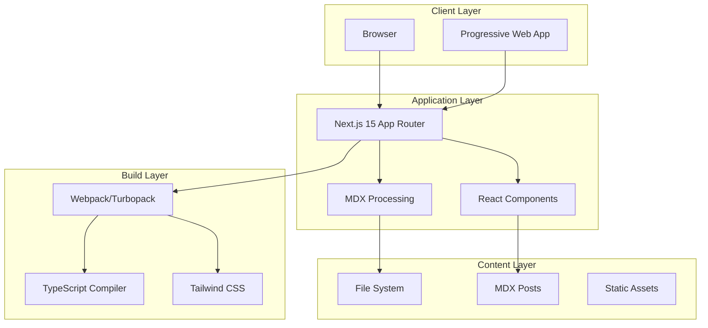

Deep dive into the technical architecture and design decisions behind Findoora Docs.

## Architectural Overview

Findoora Docs is built with a modern, scalable architecture focusing on:

- Performance: Static generation with dynamic capabilities
- Developer Experience: TypeScript, hot reload, and modern tooling
- Maintainability: Clean separation of concerns and modular design
- Extensibility: Plugin-ready architecture and customizable components

## System Architecture



## Directory Structure Analysis

### App Router Structure

```bash
app/
├── globals.css                 # Global styles and CSS reset
├── layout.tsx                  # Root layout (RootLayout)
├── page.tsx                    # Homepage (/)
├── loading.tsx                 # Global loading UI
├── error.tsx                   # Global error boundary
├── not-found.tsx               # 404 page
├── [category]/                 # Dynamic category routes
│   ├── page.tsx                # Category listing (/blog, /docs, etc.)
│   ├── loading.tsx             # Category loading state
│   └── [slug]/                 # Dynamic content routes
│       ├── page.tsx            # Individual content page
│       ├── loading.tsx         # Content loading state
│       └── opengraph-image.tsx # Dynamic OG image generation
├── api/                        # API routes
│   ├── health/route.ts         # Health check endpoint
│   ├── navigation/route.ts     # Navigation data API
│   ├── search/route.ts         # Search API endpoint
│   └── sitemap.xml/route.ts    # Dynamic sitemap generation
└── rss.xml/route.ts            # RSS feed generation
```

### Component Architecture

```bash
components/
├── app-shell.tsx               # Main app wrapper
├── providers.tsx               # Context providers
├── splash-screen.tsx           # Initial loading screen
├── blocks/                     # Content building blocks
│   ├── content-list.tsx        # Content listing component
│   ├── table-of-contents.tsx   # TOC component
│   └── mdx/                    # MDX-specific components
│       ├── custom-mdx.tsx      # MDX provider and components
│       ├── mdx-code.tsx        # Code block rendering
│       ├── mdx-heading.tsx     # Heading components
│       ├── mdx-image.tsx       # Image components
│       ├── mdx-link.tsx        # Link components
│       └── mdx-table.tsx       # Table component
├── features/                   # Feature-specific components
│   ├── back-to-top.tsx         # Back to top functionality
│   ├── search-dialog.tsx       # Search interface
│   ├── search.tsx              # Search components
│   └── social-share.tsx        # Social sharing
├── layout/                     # Layout components
│   ├── app-bar.tsx             # Top navigation bar
│   ├── footer.tsx              # Site footer
│   ├── main-layout.tsx         # Main content layout
│   ├── mobile-navigation.tsx   # Mobile navigation
│   ├── navigation-sidebar.tsx  # Sidebar navigation
│   ├── search-button.tsx       # Search trigger button
│   └── theme-toggle.tsx        # Dark/light mode toggle
├── pages/                      # Page-specific components
│   ├── content/                # Content page components
│   └── home/                   # Homepage components
├── providers/                  # React context providers
│   └── search-provider.tsx     # Search state management
├── seo/                        # SEO components
│   └── structured-data.tsx     # Schema.org structured data
└── ui/                         # Reusable UI components
    ├── accordion.tsx           # Collapsible content
    ├── badge.tsx               # Status badges
    ├── button.tsx              # Button component
    ├── dialog.tsx              # Modal dialogs
    ├── input.tsx               # Form inputs
    └── ...                     # Other UI primitives
```

## Core Systems

### Content Management System

The content system is built around a flexible, file-based approach:

```typescript
// lib/content.ts - Core content management
interface ContentPost {
  slug: string;
  title: string;
  menuTitle?: string;
  summary: string;
  content: string;
  category: string;
  publishedAt: string;
  updatedAt?: string;
  author?: string;
  tags?: string[];
  thumbnail?: string;
  bannerImage?: string;
  readingTime?: number;
  wordCount?: number;
}

// Content processing pipeline
export class ContentManager {
  // 1. File discovery and parsing
  private discoverContentFiles(): string[];

  // 2. Frontmatter extraction
  private extractFrontmatter(content: string): Frontmatter;

  // 3. Content processing
  private processContent(raw: string): ProcessedContent;

  // 4. Metadata generation
  private generateMetadata(post: ContentPost): Metadata;

  // 5. Caching and optimization
  private cacheContent(posts: ContentPost[]): void;
}
```

### Routing System

Dynamic routing with App Router:

```typescript
// Route patterns and their handlers
interface RoutePattern {
  pattern: string;
  handler: React.ComponentType;
  generateStaticParams?: () => Promise<Params[]>;
}

const routes: RoutePattern[] = [
  {
    pattern: "/",
    handler: HomePage,
  },
  {
    pattern: "/[category]",
    handler: CategoryPage,
    generateStaticParams: async () => {
      const categories = await getCategories();
      return categories.map((category) => ({ category }));
    },
  },
  {
    pattern: "/[category]/[slug]",
    handler: ContentPage,
    generateStaticParams: async () => {
      const posts = await getAllPosts();
      return posts.map((post) => ({
        category: post.category,
        slug: post.slug,
      }));
    },
  },
];
```

### Search System

Full-text search with client-side processing:

```typescript
// lib/utils/search.ts
export class SearchEngine {
  private index: SearchIndex;
  private posts: ContentPost[];

  constructor(posts: ContentPost[]) {
    this.posts = posts;
    this.index = this.buildSearchIndex(posts);
  }

  // Build inverted index for efficient searching
  private buildSearchIndex(posts: ContentPost[]): SearchIndex {
    const index: SearchIndex = {};

    posts.forEach((post, postIndex) => {
      const words = this.tokenize(
        post.title + " " + post.summary + " " + post.content,
      );

      words.forEach((word) => {
        if (!index[word]) {
          index[word] = [];
        }
        index[word].push({
          postIndex,
          weight: this.calculateWeight(word, post),
        });
      });
    });

    return index;
  }

  // Search with ranking
  search(query: string): SearchResult[] {
    const terms = this.tokenize(query);
    const candidates = new Map<number, number>();

    terms.forEach((term) => {
      const matches = this.index[term] || [];
      matches.forEach((match) => {
        const currentScore = candidates.get(match.postIndex) || 0;
        candidates.set(match.postIndex, currentScore + match.weight);
      });
    });

    return Array.from(candidates.entries())
      .map(([postIndex, score]) => ({
        post: this.posts[postIndex],
        score,
      }))
      .sort((a, b) => b.score - a.score);
  }
}
```

## Component Design Patterns

### Compound Components

Used for flexible, reusable UI components:

```typescript
// components/ui/card.tsx
interface CardContextValue {
  variant: 'default' | 'outlined' | 'filled';
}

const CardContext = createContext<CardContextValue | undefined>(undefined);

export const Card = ({ variant = 'default', children, ...props }) => {
  return (
    <CardContext.Provider value={{ variant }}>
      <div className={cardVariants({ variant })} {...props}>
        {children}
      </div>
    </CardContext.Provider>
  );
};

export const CardHeader = ({ children, ...props }) => {
  const context = useContext(CardContext);
  return (
    <div className={headerVariants({ variant: context?.variant })} {...props}>
      {children}
    </div>
  );
};

// Usage
<Card variant="outlined">
  <CardHeader>
    <CardTitle>Title</CardTitle>
  </CardHeader>
  <CardContent>
    Content here
  </CardContent>
</Card>
```

### Render Props Pattern

For flexible component composition:

```typescript
// components/blocks/content-list.tsx
interface ContentListProps<T> {
  items: T[];
  children: (item: T, index: number) => React.ReactNode;
  renderEmpty?: () => React.ReactNode;
  className?: string;
}

export function ContentList<T>({
  items,
  children,
  renderEmpty,
  className
}: ContentListProps<T>) {
  if (items.length === 0) {
    return renderEmpty ? renderEmpty() : <EmptyState />;
  }

  return (
    <div className={cn('space-y-4', className)}>
      {items.map((item, index) => (
        <div key={index}>
          {children(item, index)}
        </div>
      ))}
    </div>
  );
}

// Usage
<ContentList items={posts}>
  {(post) => (
    <ContentCard
      title={post.title}
      summary={post.summary}
      href={`/${post.category}/${post.slug}`}
    />
  )}
</ContentList>
```

### Higher-Order Components (HOCs)

For cross-cutting concerns:

```typescript
// lib/hocs/with-error-boundary.tsx
export function withErrorBoundary<P extends object>(
  Component: React.ComponentType<P>,
  fallback?: React.ComponentType<{ error: Error }>
) {
  return function WithErrorBoundaryComponent(props: P) {
    return (
      <ErrorBoundary fallback={fallback}>
        <Component {...props} />
      </ErrorBoundary>
    );
  };
}

// Usage
const SafeContentRenderer = withErrorBoundary(
  ContentRenderer,
  ({ error }) => <div>Failed to render content: {error.message}</div>
);
```

## State Management

### React Context Pattern

For global state management:

```typescript
// providers/search-provider.tsx
interface SearchState {
  query: string;
  results: SearchResult[];
  isSearching: boolean;
  filters: SearchFilters;
}

interface SearchActions {
  setQuery: (query: string) => void;
  search: (query: string) => Promise<void>;
  applyFilters: (filters: SearchFilters) => void;
  clearSearch: () => void;
}

const SearchContext = createContext<SearchState & SearchActions | undefined>(undefined);

export function SearchProvider({ children }: { children: React.ReactNode }) {
  const [state, setState] = useState<SearchState>({
    query: '',
    results: [],
    isSearching: false,
    filters: {},
  });

  const searchEngine = useMemo(() => new SearchEngine(posts), [posts]);

  const actions: SearchActions = {
    setQuery: (query) => setState(prev => ({ ...prev, query })),

    search: async (query) => {
      setState(prev => ({ ...prev, isSearching: true }));

      try {
        const results = await searchEngine.search(query);
        setState(prev => ({
          ...prev,
          results,
          isSearching: false
        }));
      } catch (error) {
        setState(prev => ({
          ...prev,
          isSearching: false,
          results: []
        }));
      }
    },

    // ... other actions
  };

  return (
    <SearchContext.Provider value={{ ...state, ...actions }}>
      {children}
    </SearchContext.Provider>
  );
}

export const useSearch = () => {
  const context = useContext(SearchContext);
  if (!context) {
    throw new Error('useSearch must be used within SearchProvider');
  }
  return context;
};
```

## Performance Architecture

### Static Generation Strategy

```typescript
// Static generation with ISR
export async function generateStaticParams() {
  const posts = await getContentPosts();

  return posts.map((post) => ({
    category: post.category,
    slug: post.slug,
  }));
}

export async function generateMetadata({
  params,
}: {
  params: { category: string; slug: string };
}) {
  const post = await getContentPost(params.slug);

  return {
    title: post.title,
    description: post.summary,
    openGraph: {
      title: post.title,
      description: post.summary,
      images: [post.thumbnail],
    },
  };
}

// Incremental Static Regeneration
export const revalidate = 3600; // Revalidate every hour
```

### Code Splitting Strategy

```typescript
// Dynamic imports for heavy components
const MermaidDiagram = dynamic(() => import('./mermaid-diagram'), {
  loading: () => <DiagramSkeleton />,
  ssr: false,
});

const CodePlayground = dynamic(() => import('./code-playground'), {
  loading: () => <PlaygroundSkeleton />,
});

// Route-based code splitting is automatic with App Router
// Component-based splitting for large features
const SearchDialog = dynamic(() => import('./search-dialog'), {
  loading: () => <SearchSkeleton />,
});
```

### Caching Strategy

```typescript
// Multi-layer caching strategy
export class CacheManager {
  // 1. Memory cache for frequently accessed content
  private memoryCache = new Map<string, any>();

  // 2. File system cache for processed content
  private async getCachedContent(key: string): Promise<any> {
    const cachePath = path.join(process.cwd(), ".cache", `${key}.json`);

    try {
      const cached = await fs.readFile(cachePath, "utf-8");
      return JSON.parse(cached);
    } catch {
      return null;
    }
  }

  // 3. CDN cache for static assets
  private getCDNHeaders(): Record<string, string> {
    return {
      "Cache-Control": "public, max-age=31536000, immutable",
      Vary: "Accept-Encoding",
    };
  }
}
```

## Security Architecture

### Content Security Policy

```typescript
// next.config.ts
const securityHeaders = [
  {
    key: "Content-Security-Policy",
    value: `
      default-src 'self';
      script-src 'self' 'unsafe-eval' 'unsafe-inline' *.googletagmanager.com;
      style-src 'self' 'unsafe-inline';
      img-src 'self' data: blob: *.unsplash.com;
      font-src 'self';
      object-src 'none';
      base-uri 'self';
      form-action 'self';
      frame-ancestors 'none';
      upgrade-insecure-requests;
    `
      .replace(/\s{2,}/g, " ")
      .trim(),
  },
];
```

### Input Sanitization

```typescript
// lib/utils/security.ts
export class ContentSanitizer {
  private allowedTags = [
    "h1",
    "h2",
    "h3",
    "h4",
    "h5",
    "h6",
    "p",
    "br",
    "strong",
    "em",
    "u",
    "s",
    "blockquote",
    "pre",
    "code",
    "ul",
    "ol",
    "li",
    "a",
    "img",
    "table",
    "thead",
    "tbody",
    "tr",
    "th",
    "td",
  ];

  private allowedAttributes = {
    a: ["href", "title", "target", "rel"],
    img: ["src", "alt", "title", "width", "height"],
    code: ["className"],
    // ... more allowed attributes
  };

  sanitize(content: string): string {
    return DOMPurify.sanitize(content, {
      ALLOWED_TAGS: this.allowedTags,
      ALLOWED_ATTR: this.allowedAttributes,
    });
  }
}
```

## Responsive Design Architecture

### Breakpoint System

```typescript
// tailwind.config.js
module.exports = {
  theme: {
    screens: {
      xs: "475px", // Extra small devices
      sm: "640px", // Small devices (mobile)
      md: "768px", // Medium devices (tablet)
      lg: "1024px", // Large devices (laptop)
      xl: "1280px", // Extra large devices (desktop)
      "2xl": "1536px", // 2X large devices (large desktop)
    },
  },
};
```

### Component Responsiveness

```typescript
// Responsive component pattern
export function ResponsiveLayout({ children }: { children: React.ReactNode }) {
  const isMobile = useMediaQuery('(max-width: 768px)');

  return (
    <div className="min-h-screen">
      {isMobile ? (
        <MobileLayout>{children}</MobileLayout>
      ) : (
        <DesktopLayout>{children}</DesktopLayout>
      )}
    </div>
  );
}
```

## Testing Architecture

### Testing Strategy

```typescript
// Testing pyramid implementation
describe('Content System', () => {
  // Unit tests - fast, focused
  describe('ContentParser', () => {
    it('should parse frontmatter correctly', () => {
      const parser = new ContentParser();
      const result = parser.parse(sampleContent);
      expect(result.frontmatter.title).toBe('Test Title');
    });
  });

  // Integration tests - component interactions
  describe('ContentRenderer', () => {
    it('should render content with proper structure', () => {
      render(<ContentRenderer content={mockContent} />);
      expect(screen.getByRole('article')).toBeInTheDocument();
    });
  });

  // E2E tests - user workflows
  describe('Content Navigation', () => {
    it('should allow users to navigate between content', async () => {
      await page.goto('/');
      await page.click('text=Documentation');
      await expect(page).toHaveURL(/\/docs/);
    });
  });
});
```

## Monitoring Architecture

### Performance Monitoring

```typescript
// lib/monitoring.ts
export class PerformanceMonitor {
  // Core Web Vitals tracking
  static trackWebVitals(metric: Metric) {
    if (process.env.NODE_ENV === "production") {
      // Send to analytics service
      analytics.track("web_vital", {
        name: metric.name,
        value: metric.value,
        id: metric.id,
      });
    }
  }

  // Custom performance marks
  static mark(name: string) {
    if (typeof performance !== "undefined") {
      performance.mark(name);
    }
  }

  static measure(name: string, startMark: string, endMark: string) {
    if (typeof performance !== "undefined") {
      performance.measure(name, startMark, endMark);
    }
  }
}
```

## Future Architecture Considerations

### Scalability Patterns

- Micro-frontends: Component-based architecture ready for federation
- Edge Computing: Content delivery optimization with edge functions
- Database Integration: Easy migration to database-backed content
- API-First: RESTful and GraphQL API layer preparation

### Extension Points

- Plugin System: Component and feature plugin architecture
- Theme System: Complete theming and branding customization
- Content Sources: Multiple content source integration (CMS, API, etc.)
- Build Plugins: Custom build-time processing

## Architecture Best Practices

### Separation of Concerns

- Clear boundaries between content, presentation, and business logic
- Modular component design with single responsibilities
- Clean API boundaries between layers

### Performance First

- Static generation where possible
- Progressive enhancement for dynamic features
- Efficient code splitting and lazy loading

### Type Safety

- Comprehensive TypeScript coverage
- Strict type checking enabled
- Runtime type validation for external data

### Maintainability

- Consistent naming conventions
- Comprehensive documentation
- Automated testing at all levels

---

This architecture provides a solid foundation for building scalable, maintainable documentation sites while remaining flexible enough for customization and extension.

Next: [Troubleshooting Guide](./troubleshooting) | [Contributing Guide](./contributing)
