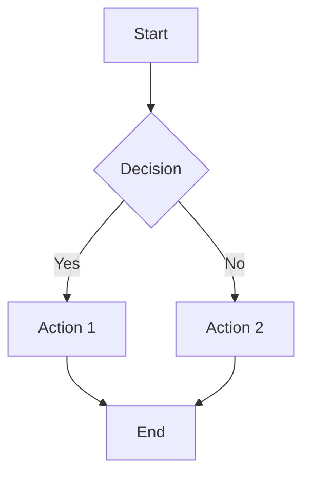

Learn how to create, organize, and manage content effectively in Findoora Docs.

## Content System Overview

Findoora Docs uses a flexible content system that supports multiple content types through a unified approach:

- **Documentation** (`category: "documents"`) - Technical guides and references
- **Blog Posts** (`category: "blog"`) - Articles, tutorials, and thoughts
- **Tutorials** (`category: "tutorial"`) - Step-by-step learning materials
- **Guides** (`category: "guide"`) - Best practices and methodologies
- **Custom Types** - Any category you define

All content is written in **MDX** (Markdown with React components) and stored in the `posts/` or `md-content/` directories.

## Creating New Content

### Step 1: Create a New MDX File

Create a new `.mdx` file in the appropriate directory:

```bash
# For blog posts
touch posts/my-new-post.mdx

# For documentation
touch md-content/my-documentation.mdx

# For tutorials
touch posts/my-tutorial.mdx
```

### Step 2: Add Frontmatter

Every content file starts with frontmatter that defines metadata:

```mdx
---
menuTitle: "Getting Started"
title: "Getting Started with Findoora Docs"
publishedAt: "2025-07-26"
summary: "A comprehensive guide to setting up and using Findoora Docs."
category: "documents"
author: "Your Name"
tags: ["setup", "configuration", "getting-started"]
thumbnail: "https://images.unsplash.com/photo-1555066931-4365d14bab8c?w=800&h=600&fit=crop"
bannerImage: "https://images.unsplash.com/photo-1517077304055-6e89abbf09b0?w=1200&h=400&fit=crop"
supportsGfm: true
hasDataTables: true
---

# Your Content Starts Here

Write your content using Markdown syntax...
```

### Frontmatter Fields

| Field           | Required | Description                     | Example                                |
| --------------- | -------- | ------------------------------- | -------------------------------------- |
| `menuTitle`     | ✅       | Short title for navigation      | `"Getting Started"`                    |
| `title`         | ✅       | Full page title                 | `"Getting Started with Findoora Docs"` |
| `publishedAt`   | ✅       | Publication date                | `"2025-07-26"`                         |
| `summary`       | ✅       | Brief description               | `"A guide to setup..."`                |
| `category`      | ✅       | Content category                | `"docs"`, `"blog"`, `"tutorial"`       |
| `author`        | ❌       | Author name                     | `"John Doe"`                           |
| `tags`          | ❌       | Array of tags                   | `["setup", "guide"]`                   |
| `thumbnail`     | ❌       | Preview image URL               | `"https://example.com/image.jpg"`      |
| `bannerImage`   | ❌       | Header image URL                | `"https://example.com/banner.jpg"`     |
| `supportsGfm`   | ❌       | Enable GitHub Flavored Markdown | `true`                                 |
| `hasDataTables` | ❌       | Enable data table styling       | `true`                                 |

## Writing Content

### Basic Markdown Syntax

```mdx
# Heading 1

## Heading 2

### Heading 3

**Bold text** and _italic text_

[Link text](https://example.com)

> This is a blockquote

- Unordered list item
- Another item

1. Ordered list item
2. Another item
```

### Code Blocks with Syntax Highlighting

````mdx
```typescript
interface User {
  id: string;
  name: string;
  email: string;
}

const fetchUser = async (id: string): Promise<User> => {
  const response = await fetch(`/api/users/${id}`);
  return response.json();
};
```
````

Supported languages include: `typescript`, `javascript`, `python`, `bash`, `json`, `yaml`, `sql`, `css`, `html`, and many more.

### Interactive Code Blocks

````mdx
```tsx title="components/example.tsx" {1,3-5} showLineNumbers
import React from "react";

export function Example() {
  return <div>Hello World!</div>;
}
```
````

Features:

- `title="filename"` - Show filename
- `{1,3-5}` - Highlight specific lines
- `showLineNumbers` - Display line numbers

### Tables

```mdx
| Feature         | Supported | Notes                      |
| --------------- | --------- | -------------------------- |
| Basic tables    | ✅        | Standard Markdown          |
| Aligned content | ✅        | Left, center, right        |
| Complex data    | ✅        | With `hasDataTables: true` |

| Left Aligned | Center Aligned | Right Aligned |
| :----------- | :------------: | ------------: |
| Data         |      Data      |          Data |
```

### Task Lists

```mdx
- [x] Completed task
- [ ] Pending task
- [ ] Future enhancement
  - [ ] Sub-task 1
  - [ ] Sub-task 2
```

### Callouts and Alerts

```mdx
> 💡 **Pro Tip**: Use frontmatter to add rich metadata to your content.

> ⚠️ **Warning**: Always backup your content before major changes.

> 📝 **Note**: This feature requires additional configuration.

> 🚨 **Important**: Breaking changes in version 2.0.
```

### Mermaid Diagrams

````mdx

````

Supported diagram types:

- Flowcharts
- Sequence diagrams
- Class diagrams
- State diagrams
- Gantt charts
- Pie charts

### Math Equations

```mdx
Inline math: $E = mc^2$

Block math:

$$
\int_{-\infty}^{\infty} e^{-x^2} dx = \sqrt{\pi}
$$
```

## Using React Components

### Built-in Components

You can use React components directly in your MDX:

```mdx
<CustomComponent title="Important Note">
  This is a custom component with **markdown** support!
</CustomComponent>

<div className="bg-blue-50 p-4 rounded-lg">
  This is a styled div with Tailwind classes.
</div>
```

### Creating Custom Components

1. Create a component in `components/blocks/mdx/`:

```tsx
// components/blocks/mdx/info-box.tsx
interface InfoBoxProps {
  type?: "info" | "warning" | "success" | "error";
  title?: string;
  children: React.ReactNode;
}

export function InfoBox({ type = "info", title, children }: InfoBoxProps) {
  const styles = {
    info: "bg-blue-50 border-blue-200 text-blue-800",
    warning: "bg-yellow-50 border-yellow-200 text-yellow-800",
    success: "bg-green-50 border-green-200 text-green-800",
    error: "bg-red-50 border-red-200 text-red-800",
  };

  return (
    <div className={`p-4 border rounded-lg ${styles[type]}`}>
      {title && <h4 className="font-semibold mb-2">{title}</h4>}
      <div className="prose prose-sm">{children}</div>
    </div>
  );
}
```

2. Register it in `components/blocks/mdx/custom-mdx.tsx`:

```tsx
import { InfoBox } from "./info-box";

const components = {
  // ... existing components
  InfoBox,
};
```

3. Use it in your MDX:

```mdx
<InfoBox type="warning" title="Important">
  This is a warning message with **markdown** support.
</InfoBox>
```

## Content Organization

### Directory Structure

```bash
posts/                          # Main content directory
├── blog/                       # Blog posts (optional subdirectory)
├── tutorials/                  # Tutorial content
└── guides/                     # Guide content

md-content/                     # Alternative content directory
├── getting-started.mdx
├── installation.mdx
└── configuration.mdx
```

### Category-Based Organization

Content is automatically organized by the `category` field:

- **`docs`** - Documentation pages
- **`blog`** - Blog articles
- **`tutorial`** - Learning materials
- **`guide`** - Best practices
- **Custom categories** - Define your own

### URL Structure

URLs are generated based on category and filename:

- `posts/my-post.mdx` with `category: "blog"` → `/blog/my-post`
- `md-content/setup.mdx` with `category: "documents"` → `/docs/setup`
- `posts/react-tutorial.mdx` with `category: "tutorial"` → `/tutorial/react-tutorial`

### Navigation Generation

Navigation is automatically generated from your content:

```typescript
// Automatic navigation structure
{
  "docs": [
    { title: "Getting Started", slug: "getting-started" },
    { title: "Installation", slug: "installation" },
    { title: "Configuration", slug: "configuration" }
  ],
  "blog": [
    { title: "My First Post", slug: "my-first-post" },
    { title: "Advanced Tips", slug: "advanced-tips" }
  ]
}
```

## Content Metadata

### Tags and Categorization

Use tags for additional organization:

```mdx
---
category: "documents"
tags: ["setup", "configuration", "beginner", "tutorial"]
---
```

Tags enable:

- Filtering content by topic
- Related content suggestions
- Search improvements
- Content discovery

### Author Information

Add author details for multi-author sites:

```mdx
---
author: "John Doe"
authorBio: "Senior Developer at Company"
authorAvatar: "/images/authors/john-doe.jpg"
authorTwitter: "@johndoe"
authorGitHub: "johndoe"
---
```

### Publication Dates

Use proper date formatting:

```mdx
---
publishedAt: "2025-07-26"
updatedAt: "2025-07-28"
---
```

## Content Discovery

### Search Integration

All content is automatically indexed for search:

- **Full-text search** across titles, summaries, and content
- **Category filtering** for targeted searches
- **Tag-based filtering** for topic discovery
- **Relevance scoring** with highlighted matches

### Related Content

The system automatically suggests related content based on:

- Shared categories
- Common tags
- Similar titles
- Content similarity

### Table of Contents

Automatic TOC generation from headings:

```mdx
## Section 1

### Subsection 1.1

### Subsection 1.2

## Section 2

### Subsection 2.1
```

Configure TOC behavior:

```tsx
// components/blocks/table-of-contents.tsx
const TOC_CONFIG = {
  maxDepth: 3, // Maximum heading level
  enableSmoothScroll: true,
  enableActiveHighlight: true,
  enableProgressIndicator: true,
};
```

## Content Analytics

### Performance Tracking

Track content performance with built-in analytics:

- Page views
- Time on page
- Scroll depth
- Search queries
- Popular content

### Content Metrics

Monitor content health:

```typescript
// Content metrics
interface ContentMetrics {
  readingTime: number; // Estimated reading time
  wordCount: number; // Total words
  headingCount: number; // Number of headings
  linkCount: number; // External links
  imageCount: number; // Images used
  lastUpdated: Date; // Last modification
}
```

## Content Best Practices

### Writing Guidelines

1. **Clear Headings**: Use descriptive, hierarchical headings
2. **Concise Summaries**: Write compelling 1-2 sentence summaries
3. **Relevant Tags**: Use 3-7 specific, relevant tags
4. **Quality Images**: Use high-quality, relevant thumbnails
5. **Code Examples**: Include working, tested code examples

### SEO Optimization

```mdx
---
title: "Complete Guide to Next.js 15 App Router"
summary: "Learn Next.js 15 App Router with practical examples, best practices, and performance tips for modern web development."
tags: ["nextjs", "react", "app-router", "web-development", "tutorial"]
---
```

### Accessibility

- Use descriptive link text
- Include alt text for images
- Structure content with proper headings
- Test with screen readers

### Performance

- Optimize images (WebP, AVIF)
- Minimize external dependencies
- Use code splitting for large examples
- Compress large content files

## Content Workflow

### Development Workflow

1. **Create content** in development environment
2. **Preview changes** with hot reload
3. **Test responsiveness** across devices
4. **Validate links** and images
5. **Review SEO** metadata
6. **Deploy** to production

### Content Review

```bash
# Validate content before publishing
pnpm lint                    # Check code quality
pnpm typecheck              # Verify TypeScript
pnpm build                  # Test production build
```

### Version Control

Use Git for content versioning:

```bash
# Track content changes
git add posts/my-new-post.mdx
git commit -m "feat: add new tutorial on Next.js routing"

# Branch for major content updates
git checkout -b content/major-update
```

## Content Troubleshooting

### Common Issues

**Content not showing:**

- Check frontmatter syntax
- Verify category spelling
- Ensure file extension is `.mdx`
- Check for TypeScript errors

**Images not loading:**

- Verify image URLs
- Check image file extensions
- Ensure proper aspect ratios
- Test image accessibility

**Code blocks not highlighting:**

- Check language specification
- Verify syntax highlighting setup
- Test with different languages

**Search not finding content:**

- Rebuild search index
- Check category inclusion
- Verify content metadata

## Next Steps

Ready to enhance your content workflow?

1. **[Development Guide](./development)** - Customize components and styling
2. **[Deployment Guide](./deployment)** - Publish your content
3. **[Architecture Guide](./architecture)** - Understand the system structure

## Content Examples

Check out these content examples:

This page is a live example of how to structure and write content in Findoora Docs.

---

Start creating amazing content! Your documentation site is ready to grow with your knowledge and expertise.
