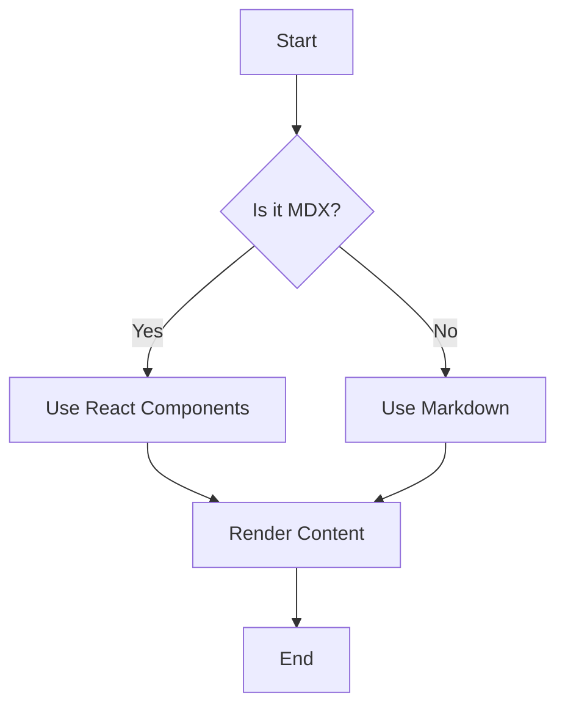

MDX combines the simplicity of Markdown with the power of React components, creating rich, interactive documentation. This post demonstrates the various features and capabilities available in our documentation system.

## Code Syntax Highlighting

Our documentation supports syntax highlighting for multiple programming languages using `rehype-pretty-code`.

### TypeScript Example

```typescript
interface User {
  id: number;
  name: string;
  email: string;
  isActive: boolean;
}

class UserService {
  private users: User[] = [];

  async createUser(userData: Omit<User, "id">): Promise<User> {
    const newUser: User = {
      id: Date.now(),
      ...userData,
    };

    this.users.push(newUser);
    return newUser;
  }

  findUserById(id: number): User | undefined {
    return this.users.find((user) => user.id === id);
  }
}
```

### React JSX Component

```jsx
import React, { useState, useEffect } from "react";

function UserProfile({ userId }) {
  const [user, setUser] = useState(null);
  const [loading, setLoading] = useState(true);

  useEffect(() => {
    async function fetchUser() {
      try {
        const response = await fetch(`/api/users/${userId}`);
        const userData = await response.json();
        setUser(userData);
      } catch (error) {
        console.error("Failed to fetch user:", error);
      } finally {
        setLoading(false);
      }
    }

    fetchUser();
  }, [userId]);

  if (loading) return <div>Loading...</div>;
  if (!user) return <div>User not found</div>;

  return (
    <div className="user-profile">
      <h2>{user.name}</h2>
      <p>Email: {user.email}</p>
      <span className={cn(`status`,${user.isActive ? "active" : "inactive"})}>
        {user.isActive ? "Active" : "Inactive"}
      </span>
    </div>
  );
}

export default UserProfile;
```

### Python Data Processing

```python
import pandas as pd
import numpy as np
from typing import List, Dict, Optional

class DataProcessor:
    def __init__(self, data: pd.DataFrame):
        self.data = data
        self.processed_data: Optional[pd.DataFrame] = None

    def clean_data(self) -> 'DataProcessor':
        """Remove duplicates and handle missing values."""
        self.data = self.data.drop_duplicates()
        self.data = self.data.fillna(method='forward')
        return self

    def apply_transformations(self, transformations: List[callable]) -> 'DataProcessor':
        """Apply a series of transformations to the data."""
        for transform in transformations:
            self.data = transform(self.data)
        return self

    def get_summary_stats(self) -> Dict[str, float]:
        """Generate summary statistics."""
        numeric_columns = self.data.select_dtypes(include=[np.number])
        return {
            'mean': numeric_columns.mean().to_dict(),
            'median': numeric_columns.median().to_dict(),
            'std': numeric_columns.std().to_dict()
        }

# Usage example
processor = DataProcessor(df)
stats = (processor
         .clean_data()
         .apply_transformations([lambda x: x * 2, np.log])
         .get_summary_stats())
```

### Shell Commands

```bash
# Install dependencies
npm install @next/mdx rehype-pretty-code rehype-slug

# Start development server
pnpm dev

# Build for production
pnpm build && pnpm start

# Run tests with coverage
pnpm test:coverage

# Analyze bundle size
ANALYZE=true pnpm build
```

### SQL Queries

```sql
-- Complex query with CTEs and window functions
WITH user_activity AS (
  SELECT
    u.id,
    u.name,
    u.email,
    COUNT(p.id) as post_count,
    AVG(p.view_count) as avg_views,
    MAX(p.created_at) as last_post_date,
    ROW_NUMBER() OVER (ORDER BY COUNT(p.id) DESC) as activity_rank
  FROM users u
  LEFT JOIN posts p ON u.id = p.author_id
  WHERE u.is_active = true
    AND u.created_at >= '2024-01-01'
  GROUP BY u.id, u.name, u.email
),
top_users AS (
  SELECT *
  FROM user_activity
  WHERE activity_rank <= 10
)
SELECT
  name,
  email,
  post_count,
  ROUND(avg_views, 2) as average_views,
  last_post_date,
  CASE
    WHEN post_count >= 50 THEN 'High'
    WHEN post_count >= 20 THEN 'Medium'
    ELSE 'Low'
  END as activity_level
FROM top_users
ORDER BY post_count DESC;
```

## Feature Overview

MDX provides comprehensive support for documentation needs:

### Mermaid Diagrams



### Core Features

**Syntax Highlighting** ✅ Available

- Code blocks with language-specific highlighting
- Multiple programming language support
- Custom themes and styling

**Interactive Components** ✅ Available

- React components within markdown
- Custom UI elements and widgets
- Dynamic content rendering

**Table of Contents** ✅ Available

- Auto-generated from headings
- Smooth scrolling navigation
- Hierarchical structure support

**Image Optimization** ✅ Available

- Lazy loading and responsive images
- WebP/AVIF format support
- Automatic size optimization

**Search Functionality** 🚧 In Progress

- Full-text search across content
- Advanced filtering options
- Real-time search results

**Dark Mode** ✅ Available

- Theme switching support
- Consistent styling across modes
- User preference persistence

### Performance Metrics

Our optimization efforts have yielded significant improvements:

**First Contentful Paint:** Improved from 2.1s to 0.8s (62% faster)
**Largest Contentful Paint:** Reduced from 3.4s to 1.2s (65% faster)  
**Bundle Size:** Decreased from 245 KB to 180 KB (27% smaller)
**Time to Interactive:** Enhanced from 3.8s to 1.5s (61% faster)

## Text Formatting and Typography

MDX supports all standard markdown formatting:

### Emphasis and Strong Text

You can use _italic text_ and **bold text** for emphasis. You can also combine them for **_bold and italic text_**.

### Lists and Organization

#### Unordered Lists

- **Modern Stack**: Next.js 15 with App Router
- **Type Safety**: Full TypeScript support
- **Performance**:
  - Optimized images and lazy loading
  - Bundle splitting and tree shaking
  - Static site generation
- **Developer Experience**:
  - Hot reload during development
  - Comprehensive error boundaries
  - Built-in accessibility features

#### Ordered Lists

1. **Plan** your content structure
2. **Write** your MDX files with frontmatter
3. **Style** components for consistent design
4. **Test** across different devices and browsers
5. **Deploy** using static site generation

### Blockquotes and Callouts

> "The best way to learn MDX is to start writing content and experimenting with different components. The combination of markdown simplicity and React power creates endless possibilities for interactive documentation."
>
> — Documentation Team

### Code Snippets

For inline code references, use backticks: `const greeting = "Hello, MDX!"`.

## Links and Navigation

MDX automatically handles different types of links:

- **Internal links**: [Visit our content page](/content)
- **External links**: [Next.js Documentation](https://nextjs.org/docs)
- **Anchor links**: [Jump to Performance Section](#performance-and-optimization)

## Performance and Optimization

Our MDX implementation includes several performance optimizations:

### Image Handling

Images are automatically optimized with:

- Lazy loading for better performance
- Responsive sizing based on viewport
- WebP/AVIF format support
- Proper alt text for accessibility

### Code Splitting

Components are loaded dynamically to reduce initial bundle size:

```typescript
// Dynamic imports for better performance
const ChartComponent = dynamic(() => import('./ChartComponent'), {
  loading: () => <p>Loading chart...</p>,
  ssr: false
});
```

### Static Generation

All MDX content is processed at build time for optimal performance:

```typescript
// Static paths generation
export async function generateStaticParams() {
  const posts = getContentPosts();
  return posts.map((post) => ({
    slug: post.slug,
  }));
}
```

## Tables and Data Display

MDX now supports GitHub Flavored Markdown tables with enhanced styling:

| Feature                | Description                                     | Status         |
| ---------------------- | ----------------------------------------------- | -------------- |
| Syntax Highlighting    | Code blocks with language-specific highlighting | ✅ Available   |
| Interactive Components | React components within markdown                | ✅ Available   |
| Table of Contents      | Auto-generated from headings                    | ✅ Available   |
| Image Optimization     | Lazy loading and responsive images              | ✅ Available   |
| Search Functionality   | Full-text search across content                 | 🚧 In Progress |
| Dark Mode              | Theme switching support                         | ✅ Available   |

### Performance Metrics Table

| Metric                   | Before Optimization | After Optimization | Improvement |
| ------------------------ | ------------------- | ------------------ | ----------- |
| First Contentful Paint   | 2.1s                | 0.8s               | 62% faster  |
| Largest Contentful Paint | 3.4s                | 1.2s               | 65% faster  |
| Bundle Size              | 245 KB              | 180 KB             | 27% smaller |
| Time to Interactive      | 3.8s                | 1.5s               | 61% faster  |

### Advanced Table Features

With GitHub Flavored Markdown support, you can also create:

#### Task Lists

- [x] Install remark-gfm plugin
- [x] Configure MDX with table support
- [x] Update content types
- [ ] Add table sorting functionality
- [ ] Implement table filtering

#### Strikethrough Text

You can use ~~strikethrough~~ text in tables and regular content.

#### Table Alignment

| Left Aligned | Center Aligned | Right Aligned |
| :----------- | :------------: | ------------: |
| Content      |    Content     |       Content |
| More content |  More content  |  More content |

## Advanced Features

### Table of Contents

Notice the table of contents on the right side (desktop) or above the content (mobile). It's automatically generated from your headings and provides smooth scrolling navigation.

### Social Sharing

Each post includes social sharing buttons for easy content distribution across platforms.

### SEO Optimization

Every MDX post includes:

- Structured data for search engines
- Open Graph meta tags
- Twitter Card support
- Automatic sitemap generation

### Accessibility

Our MDX implementation follows WCAG 2.1 AA guidelines:

- Proper heading hierarchy
- Alt text for images
- Keyboard navigation support
- Screen reader compatibility
- High contrast color schemes

## Custom Components

While this showcase focuses on standard MDX features, our system also supports custom React components that can be embedded within MDX content for even more interactivity.

## Conclusion

MDX provides a powerful foundation for creating rich, interactive documentation. By combining the simplicity of Markdown with React's component system, we can create engaging content that's both easy to write and maintain.

The features demonstrated here represent just the beginning of what's possible with MDX. As your documentation needs grow, you can continue to add custom components and enhance the user experience while maintaining the simplicity of markdown authoring.

Ready to start creating your own MDX content? Check out our [content creation guide](/content) to get started!
